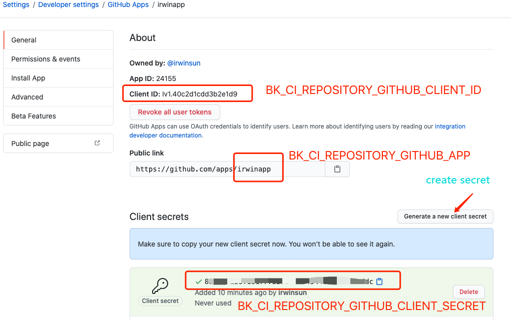
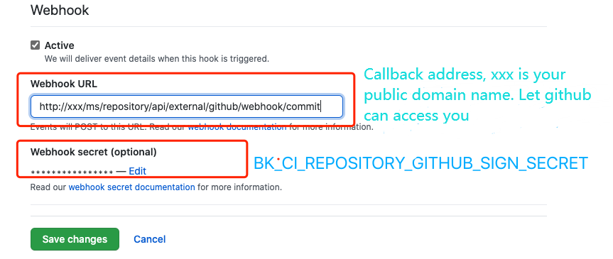

# github event triggered
If you need a GitHub event trigger, You need to deploy BKCI additional application a lot APP (https://docs.github.com/en/developers/apps/getting-started-with-apps/about-apps).

```text
The following variables need to be filled into the bkenv.properties configuration file, and then render_tpl is regenerated to generate the configuration file
```

[


[](https://user-images.githubusercontent.com/16686129/99356232-cce2c400-28e4-11eb-88bf-44e60505abbd.png)
