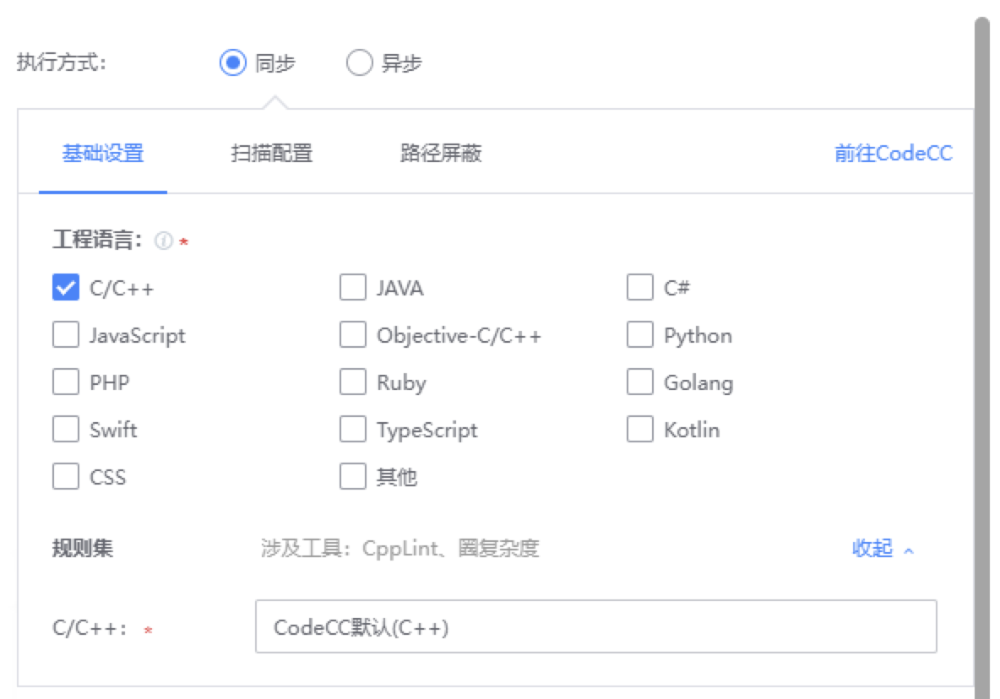
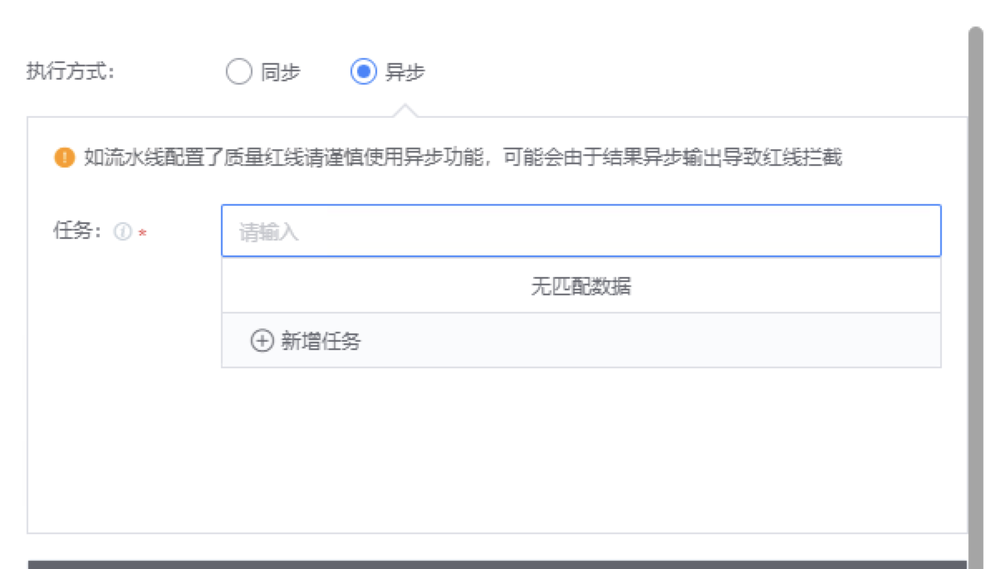

# 代码检查配置

## 执行方式
插件执行方式分为同步和异步，同步的方式，会在使用插件的同时，创建代码检查任务。异步的方式，需要先在代码检查页面创建好「自建任务」类型的代码检查任务，然后在流水线里选择对应的任务。
**同步执行方式：**

**异步执行方式：**

推荐用户使用**同步执行方式**

## 扫描配置
**增量扫描：** 扫描本次构建与上次构建的差异代码。首次为全量扫描。
**MR/PR扫描：** 扫描MR/PR的源分支与目标分支的差异代码。源分支代码需拉取到工作空间。
**全量扫描：** 扫描全部代码。Klocwork、Pinpoint、Gometalinter、重复率仅支持该扫描方式。 

## 路径屏蔽
路径屏蔽分「路径白名单」和「路径黑名单」
**路径白名单：** 一旦设置后，代码检查只会扫描白名单路径下的文件，支持通配符。
以绝对路径`/data/landun/workspace/CodeCCTest/cpp/`为例：
1. 扫描相对路径可输入`/CodeCCTest/cpp/`，只输入`/cpp/`不会生效；扫描某类文件如protobuffer生成的`*.pb.cc`，可以输入`.*/.*\.pb\.cc`；
2. 扫描工作空间中某个文件夹如P2PLive，可以输入`.*/P2PLive/.* `；
3. 只扫描某个文件夹下某类文件如P2PLive下`*.c`，可以输入`.*/P2PLive/.*\.c`；
4. 若一行中输入多个路径或路径匹配式可用英文逗号分隔；
5. 支持流水线变量
   
**路径黑名单：** 代码检查不会扫描该路径下的所有文件，支持通配符。
1. 屏蔽某类文件如protobuffer生成的`*.pb.cc`，可以输入`.*/.*\.pb\.cc`；
2. 屏蔽所有分支中某个文件夹如P2PLive，可以输入`.*/P2PLive/.* `；
3. 屏蔽某个文件夹下某类文件如P2PLive下`*.c`，可以输入`.*/P2PLive/.*\.c`；
4. 若一行中输入多个路径匹配式可用英文逗号分隔；
5. 支持流水线变量