# Code check usage

**codecc access procedure:**

1. Configure the code base as the target for code scanning
2. Create pipeline, pull object code
3. Configure the codecc plug-in
4. Execution pipeline
5. View the code review results

## codecc access

### Configuration code base

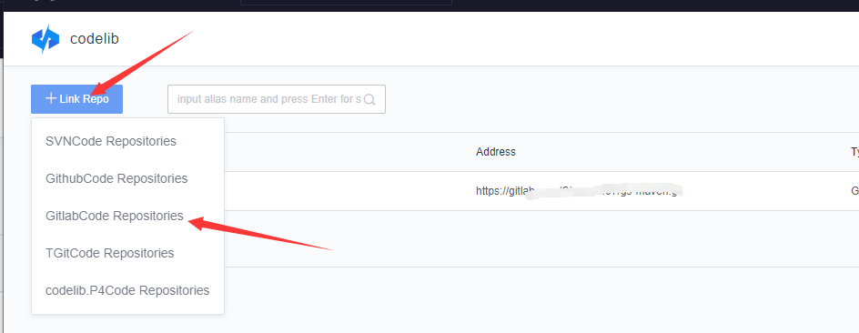

**For other types of code bases, see:** [Code Base](../repo.md)

**There are several conditions for associating the gitlab codebase:**

1. Use accesstoken to associate
2. The owner who creates accesstoken must be the maintainer role of the target warehouse
3. accesstoken requires at least api permission
4. The source code address is http/https protocol

The accesstoken is registered using "Credential management". If the accesstoken has been registered in "Credential Management", the corresponding accesstoken can be directly selected when the code base is associated

If you register accesstoken in "Credential Management", you can add new credential and jump to the credential management page

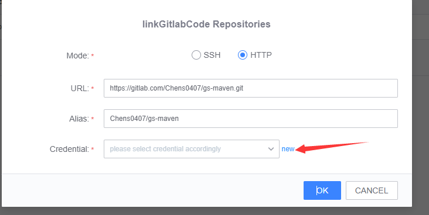

For details about how to create gitlab accesstoken, see [Creating an accesstoken](https://docs.gitlab.com/ee/user/profile/personal_access_tokens.html)

Then go back to the Associated code library page, select the accesstoken you just created, and OK

**For details about other types of [credentials, see](../ticket.md)**[ Certificate Management](../ticket.md)

### Create pipeline

"Select Project" - "Service" - "Pipeline" - "New Pipeline" - "Project Customization" - "Fill in Pipeline Name" - "New"

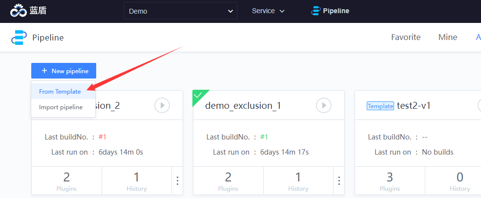

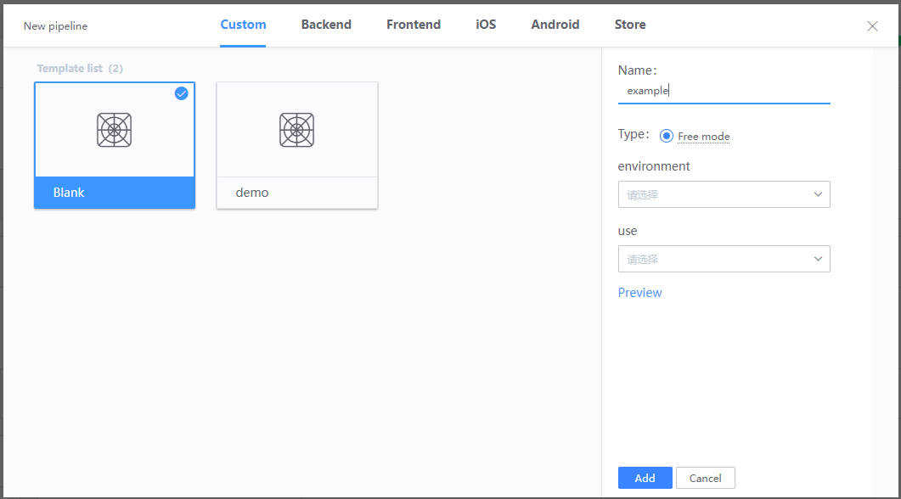

After the pipeline is created, you need to add the plug-in for code pull and the plug-in for code check. The code check needs to pull the code to the workspace where the construction environment is located, and the pull code needs to select checkout gitlab plug-in

"Add stage" - "Select linux Builder" - "Add Plug-in" - "Select checkout gitlab Plug-in"

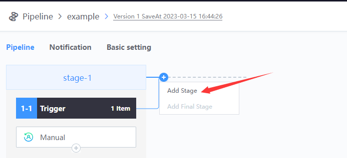

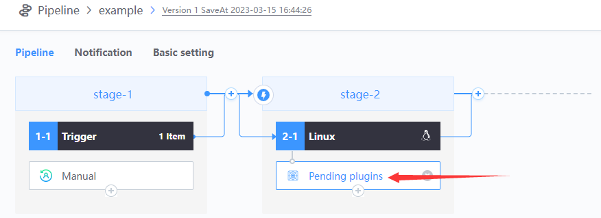

Configure the checkout gitlab plug-in and select the codebase that you created for the previous step

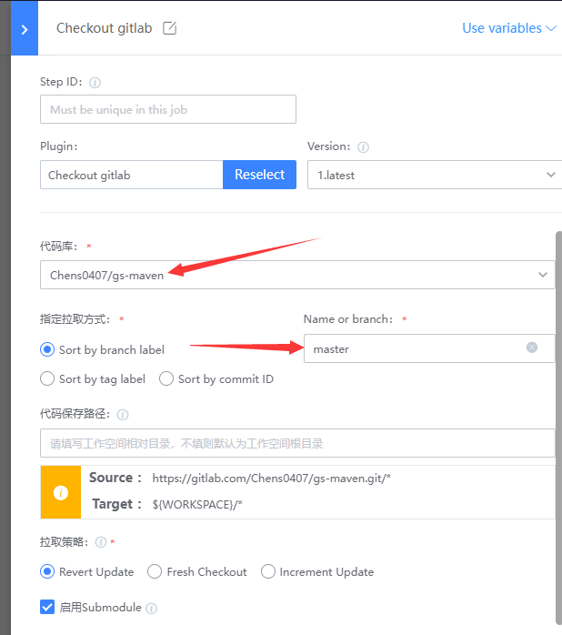

### Configuration code check

Add a code review plug-in

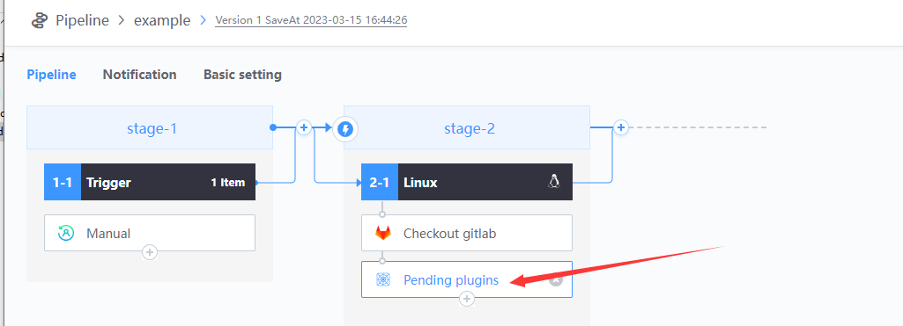

Configure the code check, select the synchronization mode, and select the corresponding engineering language and rule set according to the code base language in "Basic Settings". The rule set is the standard that codecc follows for code scanning. codecc provides the default rule set, and can customize the rule set if the rule set does not meet the requirements. For details about user-defined rule sets, see the following: Select incremental scanning in Scan Configuration for [code check rule](codecc-ruleset.md), and set path whitelist for Path Mask. Once set, code check scans only files in the whitelist path. If the path blacklist is configured, the code checking plug-in does not scan files in the path.

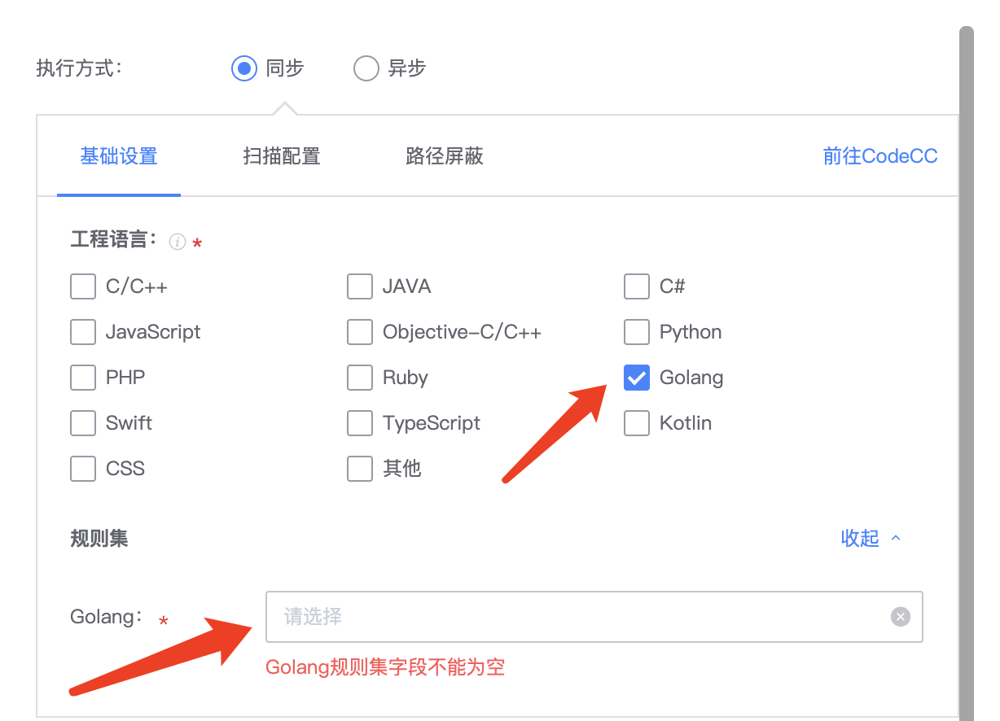

Path to support wildcards, if it is a complete path, must begin with /, such as the need to block file is' - the name/initial/SRC/main/Java/hello/HelloWorld. Java, Is the path to the white list/initial/SRC/main/Java/hello/HelloWorld. Java.

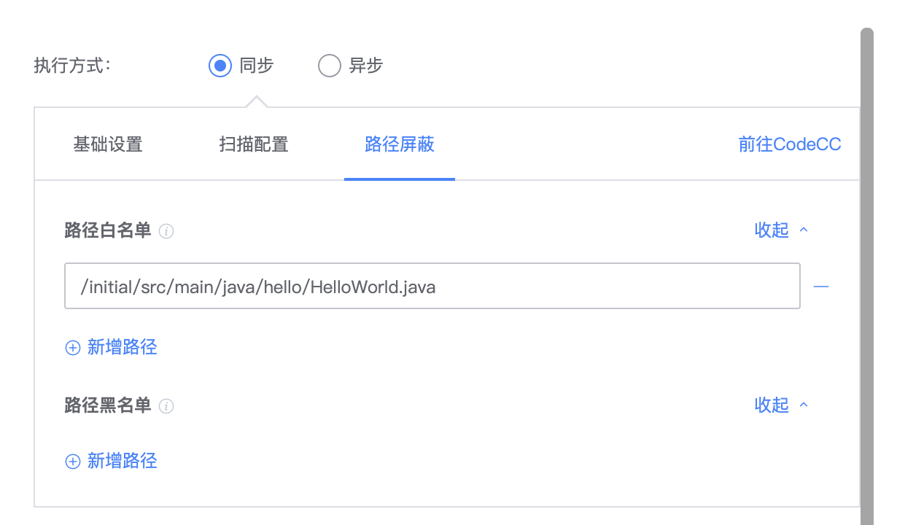

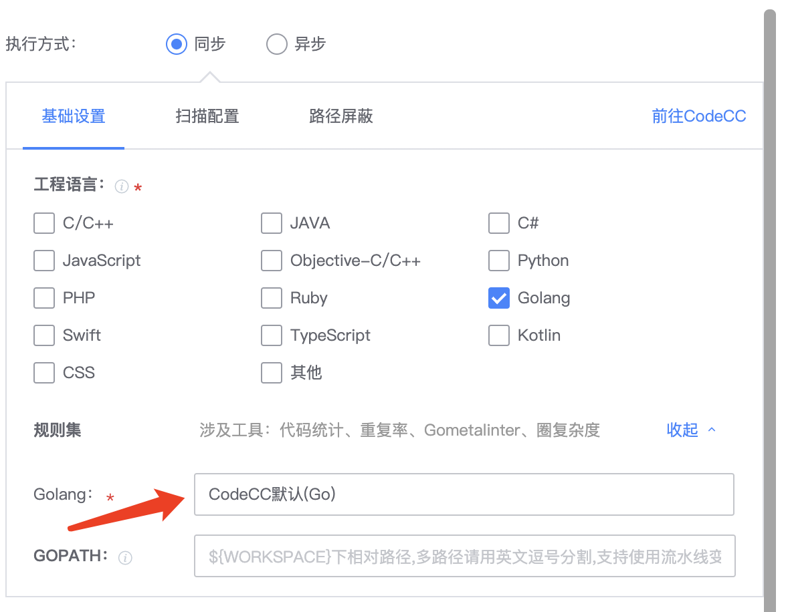

For details about how to **configure other code check plug-ins**, [see Code Check Configuration](codecc-config.md)

### Execution pipeline

General picture of assembly line:

Save and execute pipelining:

### View the code review results

"Wait for execution to finish" - "Click code to check plug-in" - "View Report"

Click on the number to jump to see the specific problem

