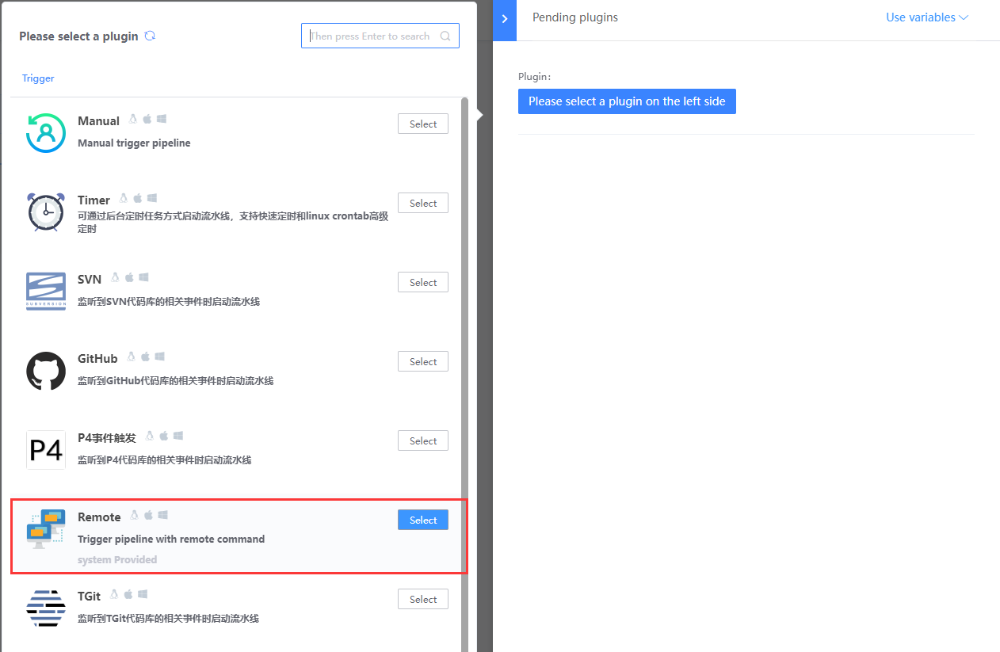
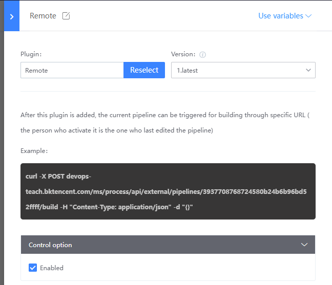
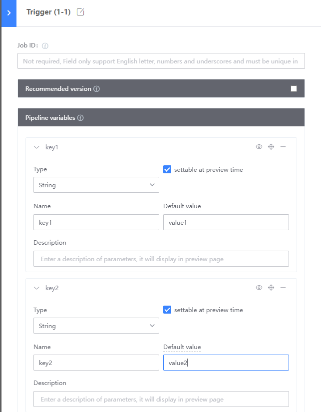
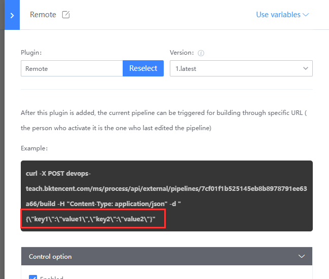

# Remote trigger mode
The remote trigger allows the user to launch the pipeline with a simple curl command. The originator is the last person to edit the pipeline
Using the remote Trigger Remote plugin:


The remote plugin provides the curl command to trigger this pipeline:




If variables are defined at the Trigger, the arguments provided during the actual call override the default arguments








```
curl -X POST devops-teach.bktencent.com/ms/process/api/external/pipelines/7cf01f1b525145eb8b8978791ee63a66/build -H "Content-Type: application/json" -d "{"key1":"value1","key2":"value2"}"
```
