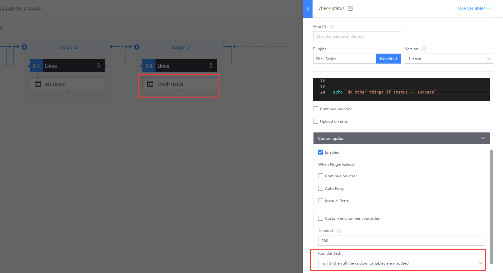
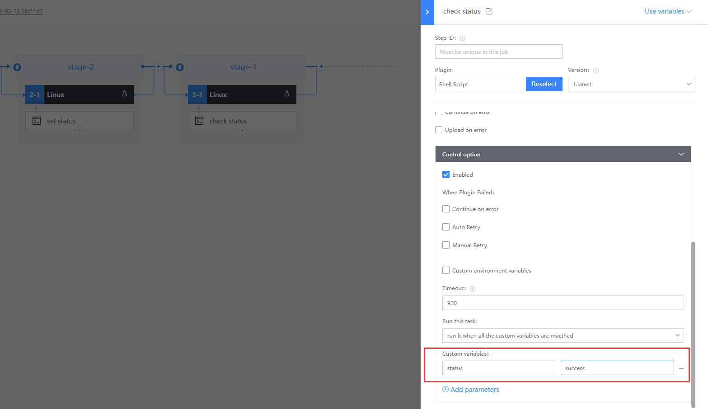

# Use variables to control the pipeline
Users can customize variables to control the execution of subsequent tasks, thus controlling the execution flow of the pipeline
**Assume a scenario: **The stage3 shell script executes when the stage2 shell script executes successfully

1. stage2 shell plug-in sets the status variable

2. 

  

3. stage3 shell plug-in select "Run it when all custom variables are macthed"

  

  

4. The shell plug-in adds' status==success 'as a new execution condition variable
  

5. If the conditions are met, the command is executed successfully

  

6. Failed to set analog variables
  

  

7. If the conditions are not met, the plug-in is not executed

  
  Similarly, you can reverse the execution criteria for a plug-in: "Don‘t run it when all the custom variables are macthed"

  