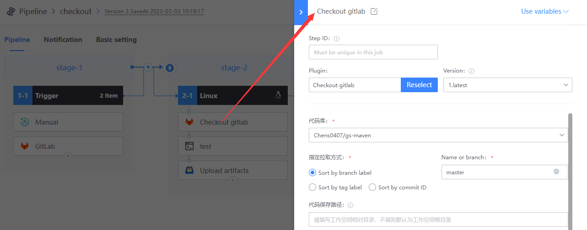

# Run bkci in your git repository

## Preparation
* A gitlab project

If not, refer to [Associate your first codebase](link-first-repo.md)

* A bk-ci project
* Understand [basic concept of pipeline](../overview/learn-pipeline-in-5-min.md)

## Listens for codebase push events via BK-CI
1. Create a blank pipeline

2. Add trigger to Job1-1: GitLab

   

3. Add Job2-1 to perform compilation tasks

   

4. Add the following three plug-ins:   

   * Checkout GitLab

   

   

   * Shell Script

     

     

   * Upload artifacts

     
     
     

