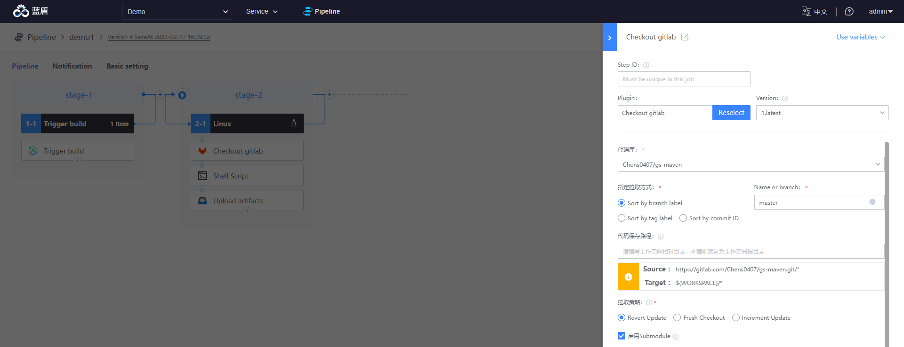
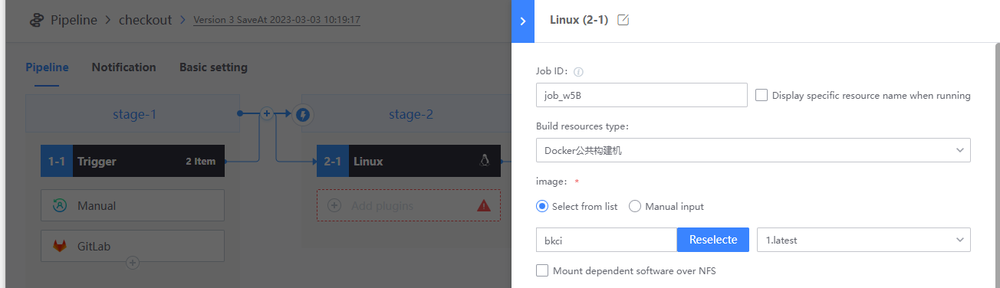
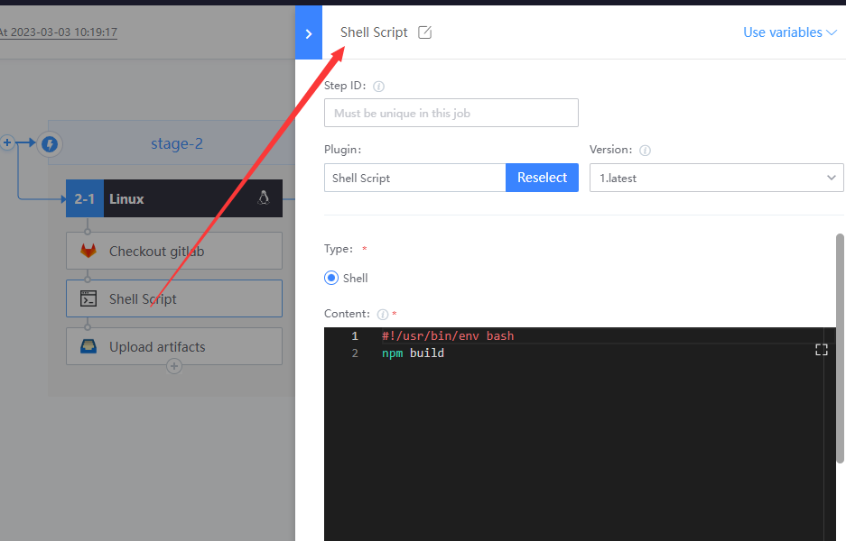

# 为你的Git工程开启CI

### 准备事项 

* 一个 gitlab 工程

如没有，请参考[关联你的第一个代码库](link-first-repo.md)

* 一个 bk-ci 项目
* 了解[流水线的基本概念](../overview/learn-pipeline-in-5-min.md)

### 通过 BK-CI 监听代码库 push 事件 

1. 创建一条空白流水线

2. 在 Job1-1 中添加触发器：GitLab

3. 添加 Job2-1，用来执行具体的编译任务

   

4. 依次添加如下 3 个插件：
   * Checkout GitLab

     

   * Shell Script

     

   * Upload artifacts

     

