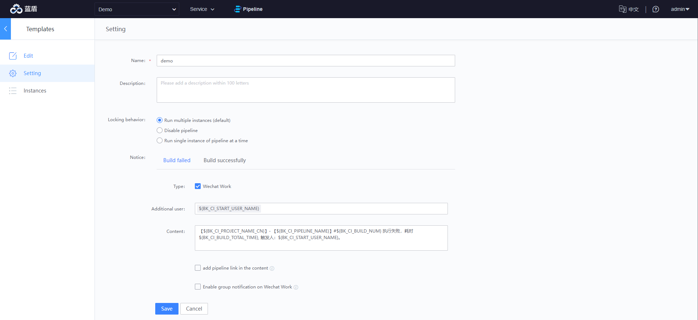

# Use templates to create pipeline
Template: pipeline-line template. You can create an pipeline-line template and set a general pipeline-line in advance. You can select a template to create an pipeline-line when creating an pipeline.

* Pipeline -> Select Template Management in the upper right corner

Simply create a new stage test

Click Save and save it as the new version v1 (the current version is init by default, you can also save it in the current version).

Click the version list in the upper right corner to view the current version, and click "Load" to switch to another version

You can also pre-set notifications for pipelines in [Settings]

* Create a pipeline using templates and select the template you created

Once created, you can see the content that was previously configured in the template
