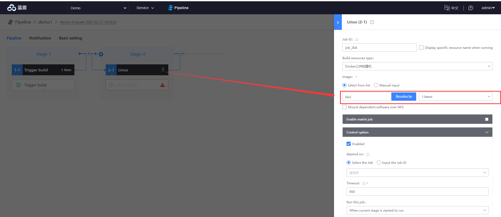
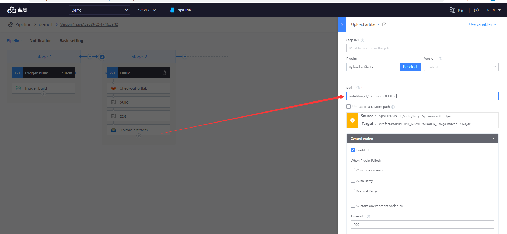
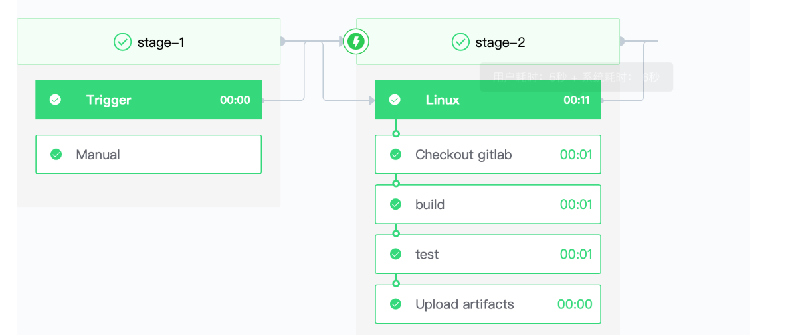

# Java Maven Demo

This article will guide you through how to compile a **Maven** project in bk-ci.
## Prepare materials
* A maven project: [https://gitlab.com/bk-ci/gs-maven.git](https://gitlab.com/bk-ci/gs-maven.git)
* a contains the MVN command CI image: [https://hub.docker.com/r/bkci/ci](https://hub.docker.com/r/bkci/ci)
## detailed steps
1. Associate the prepared gitlab codebase with bk-ci, [please refer to](../link-first-repo.md)

2. Create a blank pipeline

3. Add the Linux build environment to Job2-1 and set the image address to bkci/ci:latest   
   

4. Add the following four plug-ins:   

   1. Checkout Gitlab 

    

   2. Shell Scripts

      ```text
         #!/usr/bin/env bash
         cd initial
         mvn install
      ```

   3. Shell Scripts

         ```text
         #!/usr/bin/env bash
         cd initial
         mvn test
         ```

   4. Upload artifacts 

      

5. Run the assembly line and observe the results   
   

