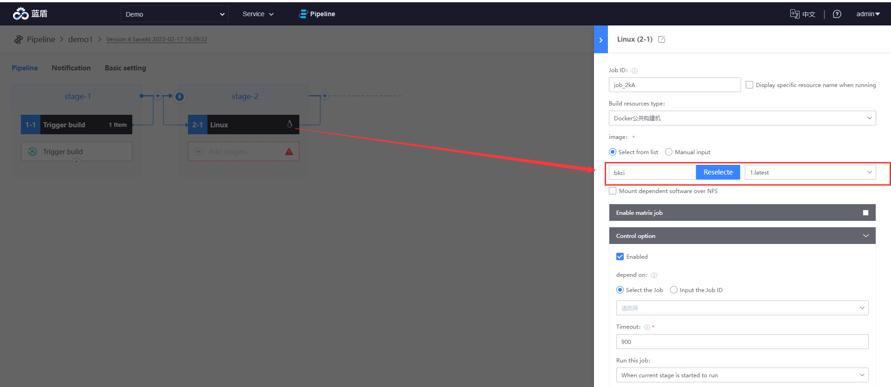
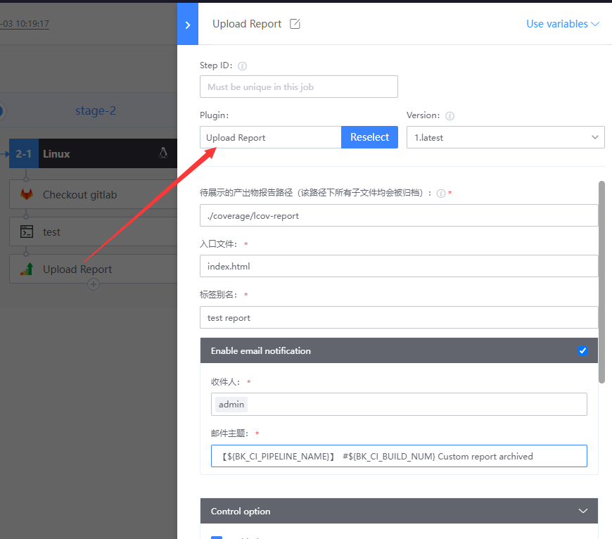
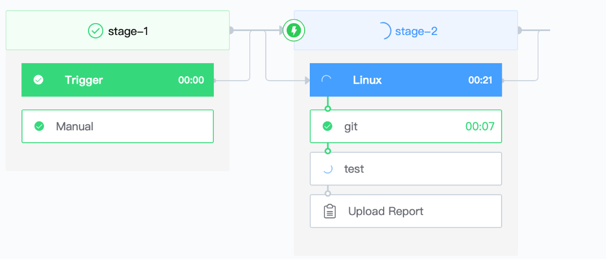

# Node Demo

This article will show you how to compile the **NodeJS** project in bk-ci.
## Prepare materials
* A NodeJS project: [https://gitlab.com/bk-ci/gs-maven.git](https://gitlab.com/bk-ci/gs-maven.git)
* a contains CI image of NPM command: [https://hub.docker.com/r/bkci/ci] (https://hub.docker.com/r/bkci/ci)
## detailed steps
1. Associate the prepared gitlab codebase with bk-ci, [please refer to](../link-first-repo.md)

2. Create a blank pipeline

3. Add the Linux build environment to Job2-1 and set the image address to bkci/ci:latest 

   




4. Add the following three plug-ins:   1. Checkout Gitlab 

    

   2. Shell Scripts

      ```text
         #!/usr/bin/env bash
         npm run test
      ```

   3. Upload artifacts 

      

5. Run the assembly line and observe the results   
   

