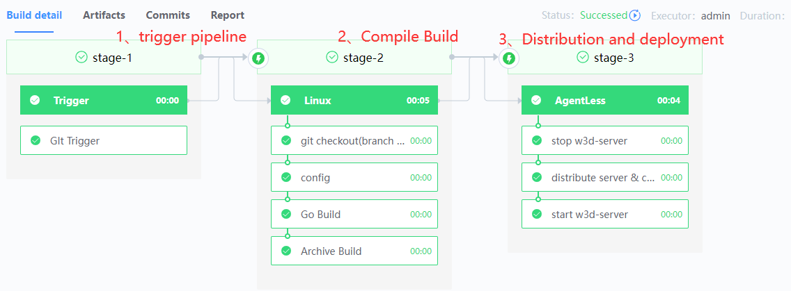
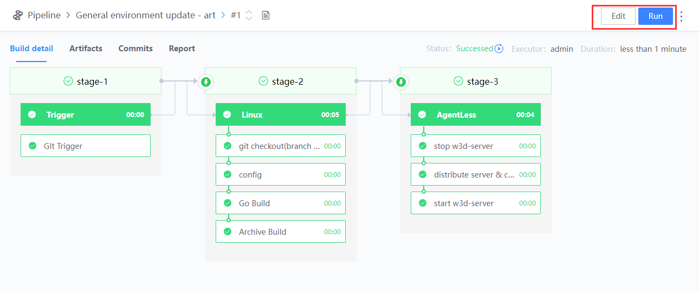

# Operations staff publish in-game operations

## Key words: game operation, event release

## Business challenge

In the game operation stage, there are often some content with short development cycle and low workload (such as the need to change the skin of an operation activity) that needs to be released to the live network. Engineers replace the material in the client engine, modify the configuration files in the code, and then build a new resource bundle, which is then configured and released.

## Blue Shield advantage

With the help of Blue Shield Pipeline's visual interface, game operators can configure and modify their own material, package, build, configure and publish it. It only takes one person to launch an operational event in a few hours.

## solution

First, developers help the game operation to configure the pipeline, which can be divided into three phases: pipeline triggering, compilation and construction, and distribution and deployment

Game operators use GIT to upload art and configuration files to the repository

The game operator opens Blue Shield, clicks "Execute" and waits for the execution to end

